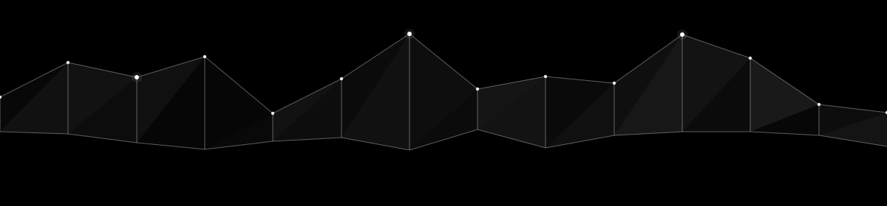

<h1>Ahmed Abdullah</h1>

 

I build things end to end, from the first line of Swift or Kotlin to the backend that keeps it running. Right now I'm a Software Engineering Trainee at Codeline by Rihal, and before that a Majan University graduate who spent too many nights chasing bugs that turned out to be one wrong character.

 

### building

**[Tanweer for iOS](https://github.com/lqji/tanweer-ios-showcase)** a Quran reader typeset to match the printed Mushaf page for page, with prayer times and Qiblah direction built in. [App Store](https://apps.apple.com/om/app/tanweer-enlighten-your-life/id6773591303)

**[Tanweer for Android](https://github.com/lqji/tanweer-android-showcase)** the same app rebuilt natively in Kotlin, matched to the iOS version screen for screen

**[Type Faster](https://github.com/lqji/type-faster-showcase)** a typing test that actually coaches your weak keys, plus live races against real people. [Try it](https://clartagency.com/type-faster)

**[Portfolio](https://github.com/lqji/portfolio)** how each of these got built, and the bugs that were hardest to track down

 

### stack

 

### activity

 

[github.com/lqji](https://github.com/lqji)

