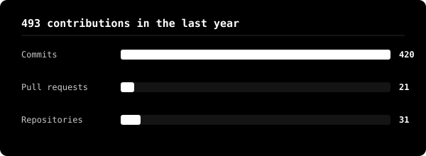

<h1>Ahmed Abdullah</h1>

 

I build things end to end, from the first line of Swift or Kotlin to the backend that keeps it running. Right now I'm a Software Engineering Trainee at Codeline by Rihal, and before that a Majan University graduate who spent too many nights chasing bugs that turned out to be one wrong character.

I've spent most of my time in C# and .NET, then branched out into Swift and Kotlin to ship the same product natively on both iOS and Android, and into React and Supabase for the web side. I also picked up Unity along the way and I'm a Certified Unity Programmer, which is where a lot of my instinct for performance and small visual details actually comes from. What I care about most is parity and correctness: if something works on one platform, it should work exactly the same way on the other, down to the pixel and the edge case.

Outside of code I'm a current gym rat and a creative tech enthusiast, I like projects where the engineering and the craft both have to hold up.

 

### building

**[Tanweer for iOS](https://github.com/lqji/tanweer-ios-showcase)** a Quran reader typeset to match the printed Mushaf page for page, with prayer times and Qiblah direction built in. [App Store](https://apps.apple.com/om/app/tanweer-enlighten-your-life/id6773591303)

**[Tanweer for Android](https://github.com/lqji/tanweer-android-showcase)** the same app rebuilt natively in Kotlin, matched to the iOS version screen for screen

**[Type Faster](https://github.com/lqji/type-faster-showcase)** a typing test that actually coaches your weak keys, plus live races against real people. [Try it](https://clartagency.com/type-faster)

**[Portfolio](https://github.com/lqji/portfolio)** how each of these got built, and the bugs that were hardest to track down

 

### stack

 

### activity

 

[github.com/lqji](https://github.com/lqji)

